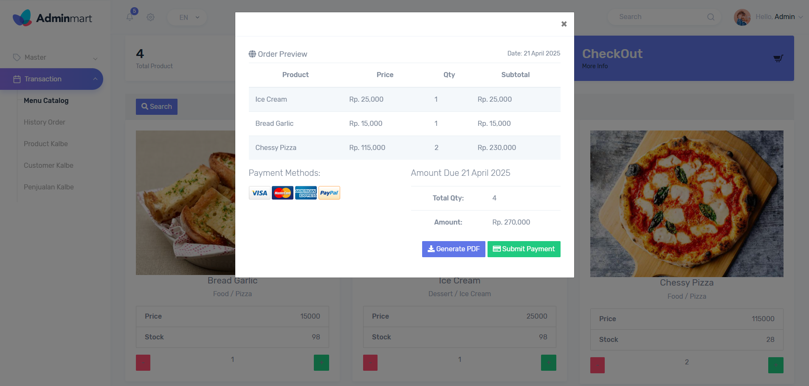
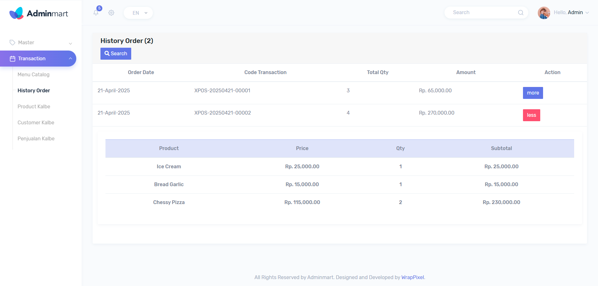

# XPOS341

## ABOUT

Point of Sales project built with .NET that I developed during Bootcamp training at Xsis Academy.

## BUILT WITH

-   .NET MVC
-   .NET API
-   Bootstrap
-   C#
-   MS SQL SERVER

## FEATURES

-   Account Login
-   CRUD for category, variant and product
-   Transaction order
-   Order history
-   Account role management

##

